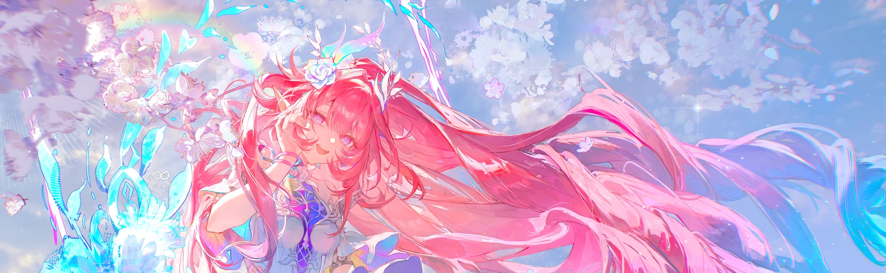
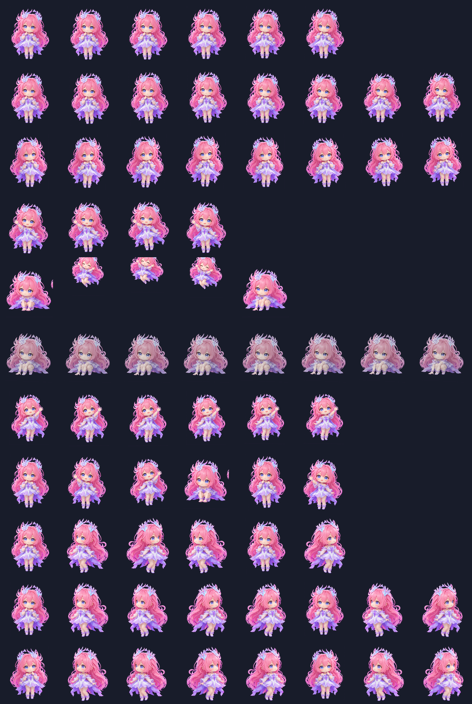

# XiLian Codex Skin

A XiLian-inspired glass theme and 3D chibi pet for the Codex desktop app.





## Features

- Pink, lavender, and glass-style Codex theme
- Optional full-screen XiLian image watermark layer
- Custom sidebar, conversation bubbles, composer, cards, and focus states
- Codex v2 pet atlas with 8 columns and 11 animation rows
- Idle, directional movement, waving, jumping, waiting, processing, review, and look states
- Transparent pet overlay with safe animation margins

## Repository layout

```text
theme/    CodexSkin theme files
pet/      Codex custom pet files
preview/  Preview images
scripts/  Portable pet atlas builder
install.sh
```

## Requirements

- macOS
- Codex desktop app
- CodexSkin for the full UI theme
- Python 3 with Pillow for the optional pet builder

## Install

```bash
git clone https://github.com/baie20070701-arch/xilian-codex-skin.git
cd xilian-codex-skin
./install.sh
```

The installer copies:

- `pet/` to `~/.codex/pets/xilian/`
- `theme/` to `~/.codex-skin-app/themes/custom-mu0wrtsv/`
- the active CodexSkin theme configuration to `~/.codex-skin-app/settings.json`

Restart CodexSkin after installation. In Codex, open **Settings → Pets**, refresh, and select **昔涟 · 3D Q版**.

## Build a pet atlas from a 4×2 pose sheet

Prepare an image with eight equal cells on a flat magenta (`#FF00FF`) background:

1. front idle
2. look left
3. look right
4. wave right hand
5. raise left hand
6. crouch
7. airborne jump
8. landing

Then run:

```bash
python3 scripts/build_pet.py \
  --input /path/to/pose-sheet.png \
  --output ./build
```

The script writes a Codex-compatible `spritesheet.webp`, `spritesheet.png`, and a QA contact sheet.

## Uninstall

```bash
rm -rf ~/.codex/pets/xilian
rm -rf ~/.codex-skin-app/themes/custom-mu0wrtsv
```

Remove `custom-mu0wrtsv` from `~/.codex-skin-app/manifest.json` if it remains listed.

## License and assets

Scripts and configuration code are released under the MIT License.

The character artwork and derived image assets are fan-made materials for personal, non-commercial use only. Rights remain with their respective owners. See [ASSETS.md](ASSETS.md).
